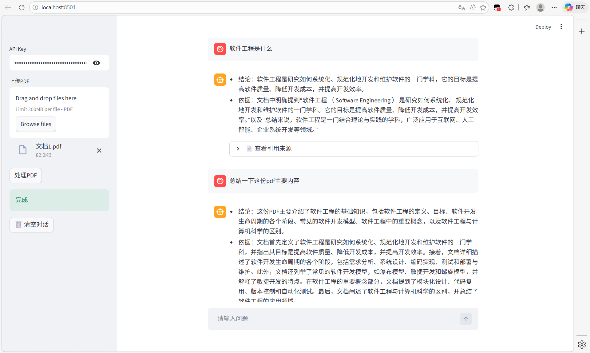

# 📄 PDF RAG Chatbot

一个基于 **RAG（Retrieval-Augmented Generation）** 的 PDF 智能问答系统，支持多轮对话、语义检索与上下文理解。

## 🚀 功能特点

* 📂 支持多PDF上传解析
* 🔍 基于 FAISS 的向量检索
* 🧠 多轮对话（问题重写）
* 📊 引用来源展示
* ⚡ Embedding 缓存优化
* 💬 类 ChatGPT 对话体验

## 🧱 技术栈

* Streamlit（前端）
* FAISS（向量检索）
* 百度千帆（Embedding + LLM）
* LangChain（文本切分）

## 🧠 设计思路

本项目采用 RAG 架构：
1. 文档切分 → Embedding
2. 用户问题 → 向量检索
3. Top-K 文本 → LLM生成回答

## 📌 项目亮点

* 实现完整RAG流程（Embedding → 检索 → LLM）
* 支持上下文感知的多轮问答
* 针对“总结类问题”做了优化处理
* 引入缓存机制降低API调用成本

## 🖥️ 使用方法

```bash
pip install -r requirements.txt
streamlit run app.py
```

## 🔑 配置

在页面中输入你的千帆 API Key


## 📷 示例




